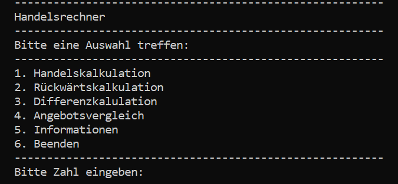
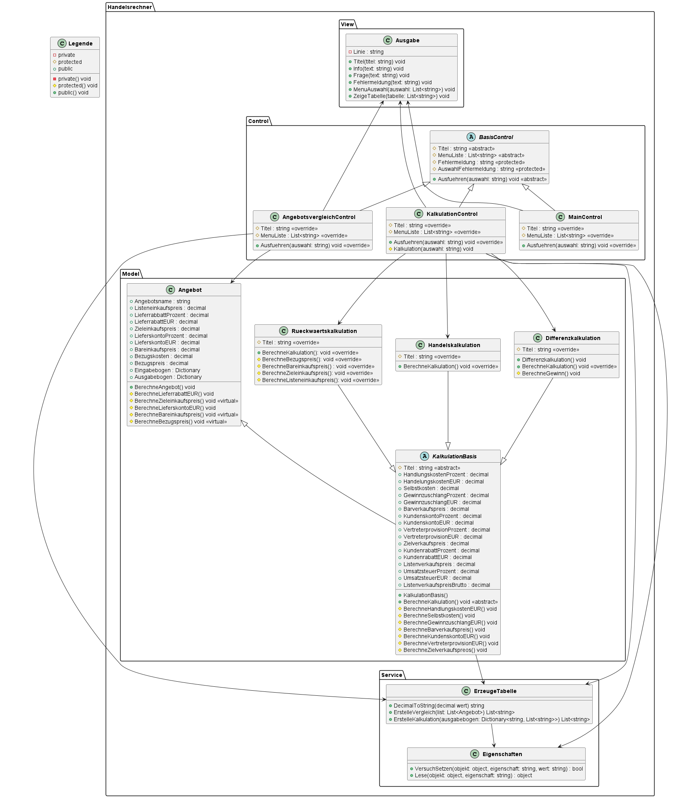
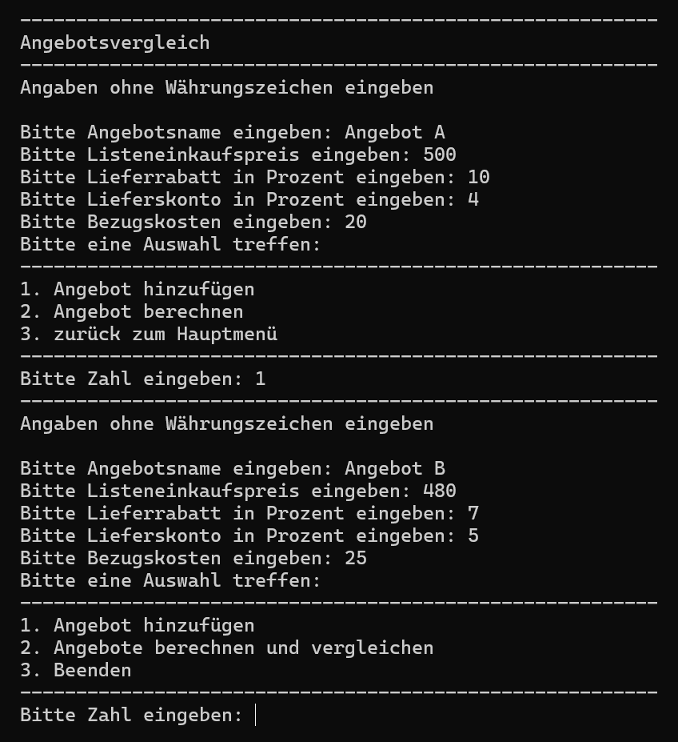
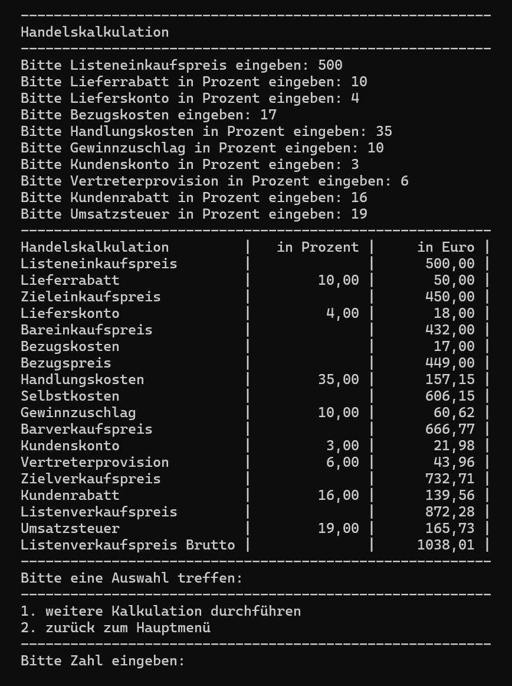

# Projekt Handelsrechner
Konsolenprogramm zur Berechnung der Handelskalkultaion, Rückwärtskalkulation und Differenzkalkulation. Zumdem kann man Angebote berechnen und vergleichen. Realisiert wurde das Projekt in C# und ein Unit-Test zur Kontrolle der Berechnung geschrieben. Bei der Erstellung wurde das MVC Pattern verwendet.

## Verwendete Technologien
- C#
- NET 8.0
- xUnit

## Projektziel:
Demonstration von Programmierkenntnisse in C# und das Sammeln von Erfahrung bei der Verwendung von Unit Test. Die Entscheidung für einen Handelsrechner fiel, da es sich um ein praxisnahes Thema mit überschaubaren Umfang handelt. 

## Funktion
- Auswahl zwischen:
  - Handelskalkulatin
  - Rückwärtskalkultion
  - Differenztialkalkulation
  - Angebotsvergleich  
- Eingabe der für die Kalkulation notwendigen Beträge  
- Berechnung der gewünschten Funktion  
- Ausgabe des Ergebnis

#### UML Klassendiagramm

## Screenshot

  

  

