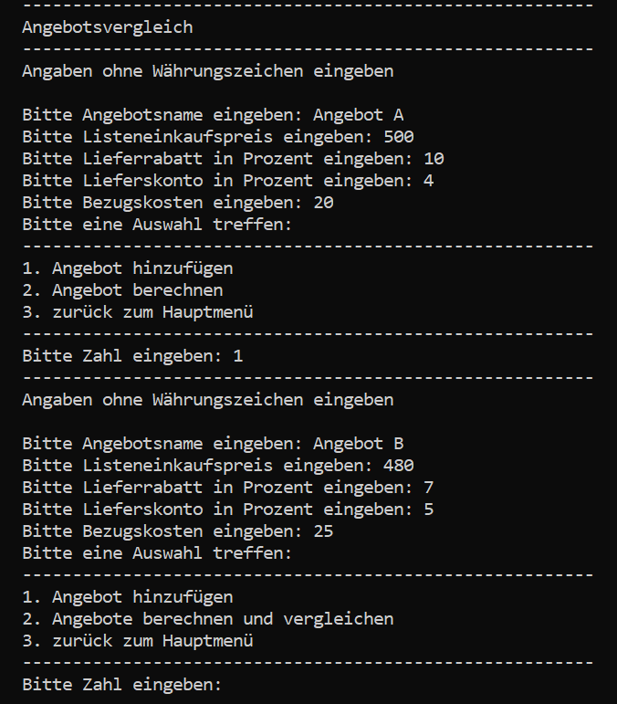

# Handelsrechner – Kalkulationstool mit C# & xUnit

## Inhaltsverzeichnis:
- [Verwendete Technologien](#verwendete-technologien)
- [Kurzvorstellung](#kurzvorstellung)
- [Übersicht](#übersicht)
  - [Funktionen](#funktionen)
  - [Klassendiagramm](#funktionen)
  - [Projektstruktur](#projektstruktur)
  - [Screenshots](#screenshots)
- [Projektvorstellung](#projektvorstellung)
- [Installation und Quellcode](#installation)
- [Lizenz](#lizenz)

---

## Verwendete Technologien
- **.NET 8.0 / C#**
- **xUnit** (Unit Testing)
- **PlantUML** (Klassendiagramm-Erstellung)

---

## Kurzvorstellung
Ein Konsolenprogramm zur Berechnung handelsüblicher Kalkulationsarten:

- **Handelskalkulation**
- **Rückwärtskalkulation**
- **Differenzkalkulation**
- **Angebotsvergleich**

 Die entwickelten Unit-Tests prüfen sowohl Einzelmethoden als auch vollständige Berechnungspfade und halfen dabei, die Robustheit des Programms deutlich zu erhöhen. Als erste praktische Anwendung von Unit-Testing konnte ich dabei wertvolle Erfahrung im Aufbau, der Strukturierung und der Fehleranalyse automatisierter Tests sammeln.

Der Schwerpunkt lag bei diesen Projekt auf den Einsatz von **xUnit** zur systematischen Absicherung der Kalkulationen. So konnte ich das schon erlernte Konzept an einen eigenen Projekt umzusetzen und Erfahrung im Umgang von automatisierten Test erlangen.

Weitere Themen die Umgesetz wurden:
- saubere **Trennung von Verantwortlichkeiten (MVC)**
- Einsatz von **abstrakten Basisklassen** zur Wiederverwendung von Logik
- Schutz kritischer Logik durch **`protected`-Zugriffe**
- Nutzung von **Reflection**, um dynamisch auf Eigenschaften zuzugreifen**
- Integration robuster **Fehlerbehandlung** für Benutzereingaben

Bei der Umsetzung orientierte ich mich an meiner früheren Client-Anwendung im MVC-Stil in Python (Projekt FoxFinance). Diese Erfahrung half mir, die neue Anwendung in C# schneller zu entwickeln, da ich vergleichbare Strukturen übernehmen konnte.
Neu für mich war der Einsatz von Reflection in C#, was mir spannende Einblicke in die dynamische Programmierung ermöglichte.
Das Projekt zeigte mir deutlich, welche Vorteile automatisierte Tests bieten – insbesondere im Hinblick auf Wartbarkeit und Fehlervermeidung. Gleichzeitig wurde mir bewusst, dass das Schreiben solcher Tests mit Aufwand verbunden ist und ihr Nutzen stark von der jeweiligen Situation abhängt.


<div style="text-align: center;">
<b>Handelsrechner: Startmenü</b> <br>

</div>

---

## Übersicht
### Funktionen
- Auswahl zwischen folgenden Berechnungsarten:
  - Handelskalkulation
  - Rückwärtskalkultion
  - Differenztialkalkulation
  - Angebotsvergleich  
- Benutzerführung über eine einfache Konsolenobergläche
- Eingabe der benötigten Werte
- Automatische Berechnung und Ausgabe des Ergebnisses  

---

### UML-Klassendiagramm
Das Klassendiagramm ist zusätzlich als `.puml`-Datei im Projektverzeichnis enthalten.
<div style="text-align: center;">

<div style="display: inline-block; margin: 5px auto; text-align: left;">
    <p>
      <b>Beschreibung:</b> Das Klassendiagramm veranschaulicht den strukturellen Aufbau des Programms. Oben befindet sich die View-Schicht, die ihre Informationen von der Control-Schicht erhält und mit der Model-Schicht integriert. Ganz unten ist die Servie-Schicht dargestellt, die Hilfklassen enthält.
    </p>
  </div>
</div>

---

### Projektstruktur
<pre style="font-size:12px; font-family:Consolas;">
Handelsrechner/
├── Handelsrechner/
│    ├── controller/
│    │    ├── AngebotsvergleichControl.cs
│    │    ├── BasisControl.cs
│    │    ├── KalkulationControl.cs
│    │    └── MainControl.cs
│    ├── model/
│    │    ├── Angebot.cs
│    │    ├── Differenzkalkulation.cs
│    │    ├── Handelskalkulation.cs
│    │    └── Rueckwaertskalkulation.cs
│    ├── service/
│    │    ├── Eigenschaften.cs
│    │    └── ErzeugeTabelle.cs
│    ├── view/
│    │    └── Ausgabe.cs
│    ├── Handelsrechner.csproj
│    └── Programm.cs
├── HandelsrechnerTest/
│    ├── AngeboteTest.cs
│    ├── DifferenzkalkulationTest.cs
│    ├── HandelskalkulationTest.cs
│    ├── HandelsrechnerTest.csproj
│    └── Rueckwaertskalkulation
├── images/ 
│    └── (enthält Screenshots für die README-Datei)
├── Handelsrechner.sln
├── Klassendiagramm.puml
├── LICENSE.txt
└── README.md
</pre>

---

### Screenshots

<div style="width: 60%; margin: 0 auto; text-align: left;">
  <h3>Angebotsvergleich: Eingabe von Angebot A und B:</h3>

<div style="display: inline-block; margin: 5px auto; text-align: left;">
    <p>
      <b>Beschreibung:</b> Im oberen Bereich erfolgt die Eingabe von Angebot A, im unteren Bereich die Eingabe von Angebot B. 
    </p>
  </div>
</div>

<div style="width: 60%; margin: 0 auto; text-align: left;">
  <h3>Angebotsvergleich: Ausgabe des Angebotsvergleich von A und B</h3>

<div style="display: inline-block; margin: 5px auto; text-align: left;">
    <p>
      <b>Beschreibung:</b> Die Ausgabe zeigt die tabellarische Darstellung der eingegebenen Angebotsdaten sowie den berechneten Bezugspreis. Zusätzlich wird angezeigt, welches Angebot günstiger ist. Möchte man weitere Angebote dem bestehenden Vergleich hinzufügen, kann dies über die Auswahl <i>„Angebote hinzufügen“</i> (Nummer 1) erfolgen. 
    </p>
  </div>
</div>

<div style="width: 60%; margin: 0 auto; text-align: left;">
  <h3>Handelskalkulation: Ausgabe einer Handelskalkulation</h3>

<div style="display: inline-block; margin: 5px auto; text-align: left;">
    <p>
      <b>Beschreibung:</b> Die fertige Handelskalkulation wird angezeigt. Im oberen Bereich befinden sich die dazugehörigen Eingaben. 
    </p>
  </div>
</div>

---

## Projektvorstellung

Dieses Projekt entstand mit dem Ziel, meine Kenntnisse in **C#** weiter auszubauen und das bereits bekannte **MVC-Prinzip** in einem neuen technologischen Umfeld praktisch anzuwenden. Die Idee für den **Handelsrechner** basiert auf Unterrichtsinhalten zur Kalkulation und bot ein klar umrissenes Szenario, das sich gut für die strukturierte Umsetzung objektorientierter Prinzipien eignete.

Im Zentrum stand die Entwicklung eines **Konsolenprogramms**, das verschiedene Kalkulationsarten unterstützt – darunter **Handelskalkulation**, **Rückwärtskalkulation**, **Differenzkalkulation** und **Angebotsvergleiche**. Die Anwendung wurde bewusst modular aufgebaut, um Wiederverwendbarkeit zu ermöglichen – etwa durch eine zentrale Ausgabeklasse und vererbte Klassenstrukturen.

Zur Umsetzung kamen zentrale Konzepte der objektorientierten Programmierung zum Einsatz:
- **Abstrakte Basisklassen** zur Bündelung gemeinsamer Logik
- **Vererbung und Polymorphie** zur Spezialisierung einzelner Kalkulationen
- **Kapselung** durch `protected`-Zugriffe auf sensible Berechnungslogik
- **Trennung von Zuständigkeiten** gemäß dem MVC-Muster

Ergänzend dazu ermöglichte der Einsatz von **Reflection** eine flexible und dynamische Verarbeitung von Benutzereingaben – ein Konzept, das ich zuvor bereits in Python kennengelernt hatte. So konnten Eigenschaften zur Laufzeit gesetzt und ausgelesen werden, ohne die Struktur der Klassen fest zu verdrahten. Fehlerhafte Eingaben – etwa ungültige Eigenschaftsnamen oder inkompatible Datentypen – werden dabei abgefangen und gezielt behandelt, ohne das Programm zu unterbrechen.

Wiederkehrende Funktionalitäten wurden in **Service-Klassen** ausgelagert, um dem **DRY-Prinzip** („Don't Repeat Yourself“) zu folgen und die Wartbarkeit zu erhöhen.

Ein zentrales Lernziel war der **Einsatz von Unit-Tests mit xUnit**. Zwar hatte ich bereits erste Erfahrungen mit Testkonzepten, doch in diesem Projekt konnte ich sie erstmals systematisch auf ein eigenes Vorhaben anwenden. Die Tests decken sowohl einzelne Methoden als auch komplette Berechnungspfade ab.

Einen echten Vorteil konnte ich daraus noch nicht vollständig ziehen, da ich bei fehlschlagenden Tests nicht nur meine Funktionen, sondern auch die Testsyntax selbst hinterfragen musste. Dennoch war diese Auseinandersetzung sehr lehrreich und hat mein Verständnis für automatisierte Tests deutlich vertieft.

Insgesamt hat mir das Projekt nicht nur die Stärken und Herausforderungen automatisierter Tests vor Augen geführt, sondern auch geholfen, meinen Programmierhorizont zu erweitern und mein Wissen über Kalkulationen im Handel zu festigen.

---

## Installation und Quellcode
Die aktuelle Version des Handelsrechners steht als `.exe`-Datei im Release-Bereich dieses Repositories zum [Download](https://github.com/devZenger/Handelsrechner/releases/tag/v1.0.0) bereit.  

Nach dem Herunterladen kannst du das Programm einfach per Doppelklick auf die Datei **Handelsrechner.exe** starten.
Alternative kannst du es über die Konsole ausführen. Wechsle dazu in das Verzeichnis, in dem sich die Datei befindet, und gib folgenden Befehl ein: 
```bash 
Handelsrechner.exe
```

Wär interesse am Quellcode hat, kann das Repository mit folgenden Befehl klonen:
```bash
git clone https://github.com/devZenger/Handelsrechner.git
```

---

## Lizenz

Copyright (c) 2025 Christian Zenger
GitHub: https://github.com/devZenger/Handelsrechner

Dieses Projekt wurde ausschließlich zu **Lern- und Demonstrationszwecken** entwickelt.  
Die Nutzung des Quellcodes ist für den privaten, nicht-kommerziellen Gebrauch gestattet   

Der Quellcode dieses Projekts darf **für private, nicht-kommerzielle Zwecke verwendet** werden.  
Eine Weitergabe, Veränderung oder kommerzielle Nutzung ist **nur mit ausdrücklicher Genehmigung** des Autors gestattet.  
Bitte beachte, dass dieses Projekt **nicht unter einer Open-Source-Lizenz** steht, auch wenn es auf Open-Source-Komponenten basiert.

Bei Fragen oder Feedback freue ich mich über eine Nachricht.


### Verwendete Drittanbieter-Technologien

- **.NET 8.0 / C#** – [MIT License](https://github.com/dotnet/runtime/blob/main/LICENSE.TXT)
- **xUnit** – [Apache 2.0 License](https://github.com/xunit/xunit/blob/main/LICENSE)
- **PlantUML** – [MIT License](https://plantuml.com/de/download#mit)

Bitte beachte die jeweiligen Lizenzbedingungen bei Weiterverwendung.
