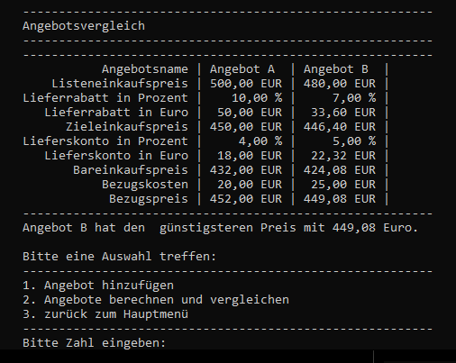

# Projekt Handelsrechner
Ein Konsolenprogramm zur Berechnung der handelsüblichen Kalkulationsarten:  
**Handelskalkultaion**, **Rückwärtskalkulation** und **Differenzkalkulation** sowie ein **Angebotsvergleich**.  
Das Programm wurde in **C# (.NET 8.0)** nach dem **MVC Pattern** strukturiert. Das Projekt diente dazu, bereits erlernte Konzepte praktisch anzuwenden, insbesondere den Einsatz von  **Unit-Tests** mit **xUnit**. Dabei stand neben der Implementierung auch die systematishe Absicherung der Krernlogik im Focus.  
Darüber hinaus bot das Projekt die Möglichkeit, die verschiedenen Kalkulationsarten im Handel praxsisnah zu wiederholen und anzuwenden.

<div style="text-align: center;">
<b>Handelsrechner: Startmenü</b> <br>

</div>

## Inhaltsverzeichnis:
- [Verwendete Technologien](#verwendete-technologien)
- [Projektvorstellung](#projektvorstellung)
- [Programmübersicht](#programmübersicht)
  - [Funktionen](#funktionen)
  - [Klassendiagramm](#funktionen)
  - [Projektstruktur](#projektstruktur)
- [Screenshots](#screenshots)
- [Installation und Quellcode](#installation)
- [Lizenz](#lizenz)

## Verwendete Technologien
- C# mit .NET 8.0
- xUnit für Unit-Tests
- PlantUML zur Erstellung des Klassendiagramms

## Projektvorstellung:
Dieses Projekt entstand mit dem Ziel, meine Kenntnisse in **C#** und **Softwarearchitektur nach dem MVC-Prinzip** praxisnah zu vertiefen. Die Idee für einen **Handelsrechner** stammt von mir – inspiriert durch Kalkulationsthemen, die im Unterricht behandelt wurden. Das klar umrissene Szenario ist zeitlich gut überschaubar und eignet sich hervorragend, um Programmierprinzipen strukturiert anzuwenden.

Bei der Umsetzung konnten verschiedene Konzepte der objektorientierten Programmierung gezielt eingesetzt werden – darunter **Klassen, Vererbung, Polymorphie** sowie **Trennung von Zuständigkeiten**. Zur zentralen Bereitstellung gemeinsamer Logik kamen **abstrakte Basisklassen** zum Einsatz. Die Kalkulationslogik wurde so gestaltet, dass sie flexibel erweiterbar bleibt; spezifische Berechnungen konnten bei Bedarf durch Überschreiben (`override`) angepasst werden. Zudem wurde auf eine saubere **Kapselung** geachtet: Die eigentliche Berechnungsfunktionenen sind als **protected** deklariert und werden kontrolliert über öffentliche Methoden ausgeführt.

Zur Erhöhung der Robustheit wurde eine grundlegende **Fehlerbehandlung** integriert, insbesondere beim **dynamischen Setzen und Auslesen** von Objekteigenschaften über **Reflection**.
Ungültige Benutzereingaben – etwa falsche Eigenschaftsnamen oder inkompatible Datentypen – werden dabei abgefangen, ohne das Programm zu unterbrechen. Die Methoden geben bei Fehlern gezielt Rückmeldungen, sodass eine kontrollierte Weiterverarbeitung möglich ist.

Wiederkehrende Logik wurde in **gemeinsamen Service-Klassen** gekapselt, womit dem **DRY-Prinzip** („Don't Repeat Yourself“) gefolgt wurde.  
Durch die Verwendung des **MVC-Patterns** ist die Anwendung klar in **Model, View und Controller** unterteilt, was die **Wartbarkeit und Testbarkeit** verbessert. 

Während des Projekts konnte ich praktische Einblicke in die Verwendung von **Reflection in C#** gewinnen – ein Konzept, das ich zuvor bereits in Python kennengelernt hatte. Es war spannend, dieses Wissen nun auch in einem C#-Projekt anzuwenden.  
Noch interessanter war für mich die Umsetzung von **Unit-Tests** mit **xUnit**. Zwar hatte ich die Grundlagen bereits in einem Online-Kurs kennengelernt, jedoch bisher nie in einem eigenen Projekt eingesetzt. Da dies meine ersten eigenständig entwickelten Tests waren, musste ich nicht nur mein Programm, sondern auch meine Tests selbst kritisch hinterfragen. Ich bin jedoch zuversichtlich, dass ich durch den Einsatz von **automatisierten Tests** künftig Zeit sparen und die Qualität meiner Anwendung weiter verbessern kann. Die Unit-Tests decken sowohl einzelne Funktionen der Modellklassen als auch das Gesamtergebnis ab.

## Programmübersicht
### Funktionen
- Auswahl zwischen folgenden Berechnungsarten:
  - Handelskalkulation
  - Rückwärtskalkultion
  - Differenztialkalkulation
  - Angebotsvergleich  
- Benutzerführung über eine einfache Konsolenobergläche
- Eingabe der benötigten Werte
- Automatische Berechnung und Ausgabe des Ergebnisses  

### UML-Klassendiagramm
Das Klassendiagramm ist zusätzlich als `.puml`-Datei im Projektverzeichnis enthalten.
<div style="text-align: center;">

<div style="display: inline-block; margin: 5px auto; text-align: left;">
    <p>
      <b>Beschreibung:</b> Das Klassendiagramm veranschaulicht den strukturellen Aufbau des Programms. Oben befindet sich die View-Schicht, die ihre Informationen von der Control-Schicht erhält und mit der Model-Schicht integriert. Ganz unten ist die Servie-Schicht dargestellt, die Hilfklassen enthält.
    </p>
  </div>
</div>

### Projektstruktur
<pre style="font-size:12px; font-family:Consolas;">
Handelsrechner/
├── Handelsrechner/
│    ├── controller/
│    │    ├── AngebotsvergleichControl.cs
│    │    ├── BasisControl.cs
│    │    ├── KalkulationControl.cs
│    │    └── MainControl.cs
│    ├── model/
│    │    ├── Angebot.cs
│    │    ├── Differenzkalkulation.cs
│    │    ├── Handelskalkulation.cs
│    │    └── Rueckwaertskalkulation.cs
│    ├── service/
│    │    ├── Eigenschaften.cs
│    │    └── ErzeugeTabelle.cs
│    ├── view/
│    │    └── Ausgabe.cs
│    ├── Handelsrechner.csproj
│    └── Programm.cs
├── HandelsrechnerTest/
│    ├── AngeboteTest.cs
│    ├── DifferenzkalkulationTest.cs
│    ├── HandelskalkulationTest.cs
│    ├── HandelsrechnerTest.csproj
│    └── Rueckwaertskalkulation
├── images/ 
│    └── (enthält Screenshots für die README-Datei)
├── Handelsrechner.sln
├── Klassendiagramm.puml
├── LICENSE.txt
└── README.md
</pre>

## Screenshots

<div style="width: 60%; margin: 0 auto; text-align: left;">
  <h3>Angebotsvergleich: Eingabe von Angebot A und B:</h3>

<div style="display: inline-block; margin: 5px auto; text-align: left;">
    <p>
      <b>Beschreibung:</b> Im oberen Bereich erfolgt die Eingabe von Angebot A, im unteren Bereich die Eingabe von Angebot B. 
    </p>
  </div>
</div>

<div style="width: 60%; margin: 0 auto; text-align: left;">
  <h3>Angebotsvergleich: Ausgabe des Angebotsvergleich von A und B</h3>

<div style="display: inline-block; margin: 5px auto; text-align: left;">
    <p>
      <b>Beschreibung:</b> Die Ausgabe zeigt die tabellarische Darstellung der eingegebenen Angebotsdaten sowie den berechneten Bezugspreis. Zusätzlich wird angezeigt, welches Angebot günstiger ist. Möchte man weitere Angebote dem bestehenden Vergleich hinzufügen, kann dies über die Auswahl <i>„Angebote hinzufügen“</i> (Nummer 1) erfolgen. 
    </p>
  </div>
</div>

<div style="width: 60%; margin: 0 auto; text-align: left;">
  <h3>Handelskalkulation: Ausgabe einer Handelskalkulation</h3>

<div style="display: inline-block; margin: 5px auto; text-align: left;">
    <p>
      <b>Beschreibung:</b> Die fertige Handelskalkulation wird angezeigt. Im oberen Bereich befinden sich die dazugehörigen Eingaben. 
    </p>
  </div>
</div>


## Installation und Quellcode
Die aktuelle Version des Handelsrechners steht als .exe-Datei im Release-Bereich dieses Repositories zum [Download](https://github.com/devZenger/Handelsrechner/releases/tag/v1.0.0) bereit.  

Nach dem Herunterladen kannst du das Programm einfach per Doppelklick auf die Datei **Handelsrechner.exe** starten.
Alternative kannst du es über die Konsole ausführen. Wechsle dazu in das Verzeichnis, in dem sich die Datei befindet, und gib folgenden Befehl ein: 
```bash 
Handelsrechner.exe
```

Wär interesse am Quellcode hat, kann das Repository mit folgenden Befehl klonen:
```bash
git clone https://github.com/devZenger/Handelsrechner.git
```

## Lizenz
Dieses Projekt wurde ausschließlich zu **Lern- und Demonstrationszwecken** entwickelt.  
Die Nutzung des Quellcodes ist für den privaten, nicht-kommerziellen Gebrauch gestattet   

Der Quellcode dieses Projekts darf **für private, nicht-kommerzielle Zwecke verwendet** werden.  
Eine Weitergabe, Veränderung oder kommerzielle Nutzung ist **nur mit ausdrücklicher Genehmigung** des Autors gestattet.  
Bitte beachte, dass dieses Projekt **nicht unter einer Open-Source-Lizenz** steht, auch wenn es auf Open-Source-Komponenten basiert.

Bei Fragen oder Feedback freue ich mich über eine Nachricht.


### Verwendete Drittanbieter-Technologien

- **.NET 8.0 / C#** – [MIT License](https://github.com/dotnet/runtime/blob/main/LICENSE.TXT)
- **xUnit** – [Apache 2.0 License](https://github.com/xunit/xunit/blob/main/LICENSE)
- **PlantUML** – [MIT License](https://plantuml.com/de/download#mit)

Bitte beachte die jeweiligen Lizenzbedingungen bei Weiterverwendung.

